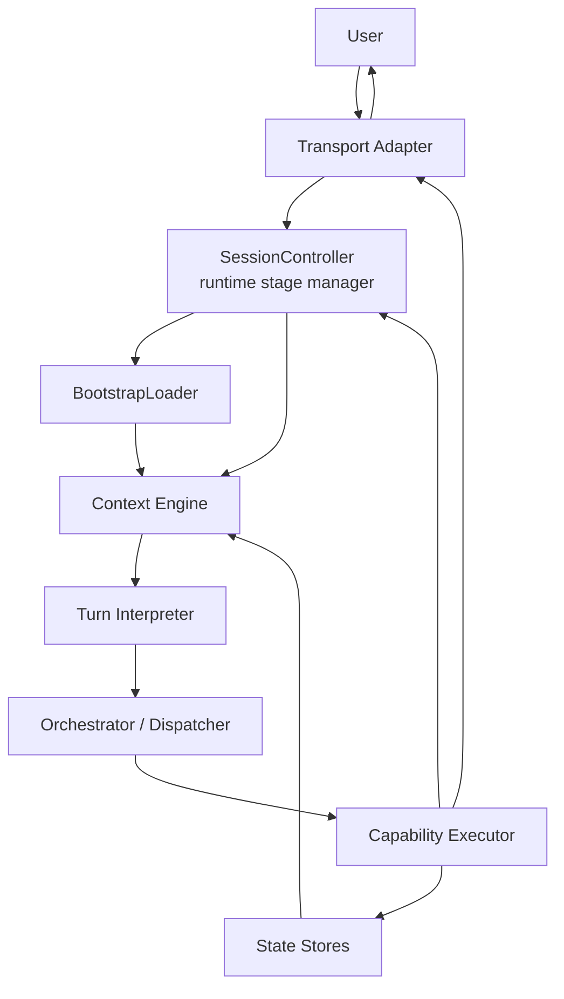

# Sofico Agent Loop V1 Spec

Last updated: 2026-04-23

## Purpose

This document is the canonical architecture spec for Sofico's next runtime step.

It defines:

- the current architecture in software terms
- the target architecture we are standardizing on
- which module owns which responsibility
- the executor contract
- the migration sequence
- the exact files likely to change first

This is the reference point that should resolve architecture drift across chats and across models.

## Core Goal

Build one clean agent loop where:

1. every learner turn goes through the same runtime path
2. the LLM interprets intent and task switches
3. deterministic code executes validated reads and writes
4. onboarding, upload confirmation, explanation, review, recall, planning, and artifact access all become capabilities in the same loop

Short rule:

- the LLM is authoritative about meaning
- executors are authoritative about state changes

## Canonical Runtime Map



## Current State

Today, Sofico is partly in this shape, but not fully:

- `chat.py` and `src/slack_bot.py` already work as transport adapters
- `src/orchestrator/session_controller.py` currently acts as both stage manager and partial business router
- `src/orchestrator/orchestrator.py` exists, but it does not yet own full executor dispatch
- `src/orchestrator/context_engine.py` exists and assembles the LLM-facing context packet
- `src/orchestrator/turn_interpreter.py` exists and can override deterministic routing in `active` mode
- existing handlers already perform most real work:
  - onboarding flow
  - ingest
  - explain
  - review
  - progress
  - curriculum

Main architectural problem:

- `SessionController` still contains too much workflow-specific logic
- some flows still bypass the clean interpreter -> dispatcher -> executor path

## Target State

The target architecture is:

- `SessionController` is only the runtime stage manager
- `SofiOrchestrator` owns turn dispatch
- `TurnInterpreter` routes all text turns, including onboarding and pending-upload confirmation
- capability executors own the business logic for each capability
- `ReflectionEngine` runs after meaningful executor completions and updates the student model

## Module Responsibilities

### 1. Transport Adapters

Files:

- `chat.py`
- `src/slack_bot.py`

Responsibilities:

- receive raw transport events
- normalize them into one runtime input shape
- pass file-upload results into the shared runtime
- render executor replies back to the channel

Non-responsibilities:

- no learning logic
- no business routing
- no direct capability decisions

### 2. SessionController

File:

- `src/orchestrator/session_controller.py`

Role:

- runtime stage manager

Responsibilities:

- restore per-user runtime state
- maintain short-lived transport/runtime state:
  - paste capture buffer
  - startup/shutdown
  - timeout check
- preload runtime dependencies for the turn
- call the orchestrator once per incoming text turn
- persist runtime state returned by the loop

Non-responsibilities:

- no permanent special-case routing for onboarding
- no permanent special-case routing for pending upload confirmation
- no capability-specific business logic except truly transport-local mechanics

### 3. BootstrapLoader

File:

- `src/orchestrator/bootstrap_loader.py`

Responsibilities:

- load teacher bootstrap every turn
- load the student model every turn
- return one preloaded bootstrap context object

Design rule:

- executors receive preloaded bootstrap from the runtime
- executors do not read bootstrap files directly

### 4. Context Engine

File:

- `src/orchestrator/context_engine.py`

Responsibilities:

- build the interpreter-facing context packet from:
  - turn
  - bootstrap
  - student model
  - current focus
  - active workflows
  - recent messages
  - available topics/documents/artifacts
  - capability summary

Important distinction:

- memory/focus/artifacts are raw stored ingredients
- the context packet is the assembled per-turn view

### 5. Turn Interpreter

File:

- `src/orchestrator/turn_interpreter.py`

Responsibilities:

- read the context packet
- return structured JSON decision:
  - capability
  - intent
  - target hints
  - continue/exit active mode
  - clarification flag
  - confidence

Design rule:

- all normal text turns pass through the interpreter
- onboarding and upload confirmation are not exceptions

### 6. SofiOrchestrator

File:

- `src/orchestrator/orchestrator.py`

Responsibilities:

- assemble context
- call the interpreter
- choose fallback when interpreter is unavailable/low-confidence
- dispatch to the correct executor
- collect the execution result
- trigger after-turn reflection hook

This becomes the main control layer.

### 7. Capability Executors

Target directory:

- `src/orchestrator/executors/`

Target executors:

- `OnboardingExecutor`
- `UploadIngestExecutor`
- `UploadConfirmationExecutor`
- `ExplainExecutor`
- `ReviewExecutor`
- `ArtifactExecutor`
- `RecallExecutor`
- `PlanStudyExecutor`
- `ProgressExecutor`
- optional later: `ResearchExecutor`

Responsibilities:

- read the needed stores/services
- run capability-specific logic
- optionally call the LLM for content generation
- return structured writes, state deltas, and user-facing messages

Design rule:

- LLM may author content and structured proposals
- executor validates and commits writes
- no raw filesystem authority is given to the LLM

### 8. Reflection Engine

File:

- `src/orchestrator/reflection_engine.py`

Responsibilities:

- convert meaningful session outcomes into `StudentMemoryUpdate` entries
- apply updates to the student model after high-signal turns

Initial scope:

- review completion
- explanation completion
- ingest completion

## Data Domains

Sofico should explicitly operate across four domains.

### Teacher Domain

Files:

- `src/orchestrator/bootstrap/SOUL.md`
- `src/orchestrator/bootstrap/IDENTITY.md`
- `src/orchestrator/bootstrap/TEACHING.md`
- `src/orchestrator/bootstrap/teacher_model.yaml`

Purpose:

- stable tutor identity and instructional stance

### Student Domain

Primary file:

- `student_model.yaml`

Purpose:

- learner identity
- goals
- preferences
- inferred profile
- progress patterns
- relationship memory

### Domain / Artifact Layer

Primary files:

- `artifacts.yaml`
- `topics/<topic>/*.md`
- `topics/<topic>/_index.yaml`

Purpose:

- uploaded sources
- learning notes
- question sets / spaced-repetition material
- later: plans and lesson materials

### Runtime State

Primary files:

- `recent_task_state.yaml`
- `conversation.yaml`
- `memory.yaml`
- `onboarding_state.yaml`
- `pending_upload.yaml`

Purpose:

- current focus
- active workflow continuation
- conversation/session continuity

## Canonical Turn Loop

For one learner text turn:

1. transport adapter receives input
2. `SessionController` restores runtime state and performs timeout check
3. `BootstrapLoader` loads teacher bootstrap and student model
4. `ContextEngine` assembles context packet
5. `TurnInterpreter` returns `TurnDecision`
6. `SofiOrchestrator` selects executor
7. executor performs reads/writes and returns `ExecutionResult`
8. `ReflectionEngine` optionally updates the student model
9. `SessionController` persists runtime state and returns output to the adapter

For file upload events:

1. transport adapter extracts or bridges upload data
2. runtime converts the upload result into shared ingest state
3. follow-up text turns still go through the same interpreter -> executor loop

## Executor Contract

The first code step is to define one formal executor contract.

Recommendation:

- use a Python `Protocol` for the executor interface
- use dataclasses for the execution payloads

Target contract:

```python
class CapabilityExecutor(Protocol):
    capability_name: str

    def execute(
        self,
        ctx: ExecutorContext,
        decision: TurnDecision,
    ) -> ExecutionResult: ...
```

Target context object:

```python
@dataclass
class ExecutorContext:
    turn: TurnContext
    state: ConversationState
    bootstrap: OrchestratorBootstrapContext
    data_service: Any
    memory_service: Any
    artifact_store: ArtifactStore
    session_response_service: Any
    controller_hooks: ControllerHooks
```

Target result object:

```python
@dataclass
class ExecutionResult:
    capability: str
    messages: list[str]
    state_delta: dict[str, Any]
    writes: list[dict[str, Any]]
    followup_action: str = ""
    reflection_input: Optional[SessionReflectionInput] = None
```

Design note:

- `controller_hooks` is a narrow helper surface for truly runtime-local actions like starting/stopping paste capture during the transition period
- it must stay small so the executor layer does not collapse back into `SessionController`

## Routing Rules

### Rule 1

All normal text turns go through:

- context assembly
- interpreter
- orchestrator dispatch

### Rule 2

`pending_upload: true` is part of context, so upload confirmation is routed like a normal capability.

### Rule 3

`needs_onboarding` and `onboarding_active` are context facts, not separate secret routers.

### Rule 4

The interpreter decides task meaning.

The executor decides validated state changes.

## LLM Boundaries

Sofico should allow the LLM to:

- choose capability
- interpret vague human language
- draft explanations
- draft notes/cards/questions
- propose student-memory observations
- propose artifact updates

Sofico should not allow the LLM to:

- directly write files
- directly mutate storage backends
- bypass executor validation

Short rule:

- LLM-authored content
- code-owned persistence

## Migration Sequence

This is the recommended implementation order.

### Step 1 — Define Executor Contract

Create:

- executor Protocol
- `ExecutorContext`
- `ExecutionResult`
- orchestrator-side executor registry/dispatch surface

### Step 2 — Wire After-Turn Reflection

Connect `ReflectionEngine` after:

- review completion
- explanation completion
- ingest completion

Reason:

- reflection becomes useful immediately
- the student model starts accumulating real inferred data before the routing refactor is complete

### Step 3 — Build OnboardingExecutor

Use existing `SoficoOnboardingFlow` as the implementation core, but wrap it behind the executor contract.

### Step 4 — Move Dispatch Into SofiOrchestrator

Refactor so:

- `SessionController` hands the turn into the orchestrator
- the orchestrator selects and runs an executor
- the orchestrator returns an `ExecutionResult`

### Step 5 — Build UploadConfirmationExecutor

Use existing `UploadHandler.handle_pending()` logic as the implementation core, but route it through the interpreter and executor contract.

### Step 6 — Thin SessionController

After the executors are in place, remove permanent workflow-specific routing from `SessionController`.

## Exact First Files To Change

### New files

- `src/orchestrator/executors/__init__.py`
- `src/orchestrator/executors/base.py`
- `src/orchestrator/executors/onboarding_executor.py`
- `src/orchestrator/executors/upload_confirmation_executor.py`

### Updated files

- `src/orchestrator/orchestrator.py`
- `src/orchestrator/session_controller.py`
- `src/orchestrator/onboarding_flow.py`
- `src/orchestrator/turn_interpreter.py`
- `src/orchestrator/reflection_engine.py`
- `src/orchestrator/student_model.py`

### Likely reused as implementation cores

- `src/handlers/upload_handler.py`
- `src/handlers/explanation_handler.py`
- `src/handlers/study_handler.py`
- `src/handlers/curriculum_handler.py`

## Definition Of Done For Agent Loop V1

Agent Loop V1 is done when:

- onboarding is executed through the interpreter + executor loop
- pending upload confirmation is executed through the same loop
- `SessionController` no longer contains permanent workflow routing for those two flows
- `SofiOrchestrator` owns dispatch
- at least three executors can return `reflection_input`
- the student model starts updating from real usage
- CLI and Slack both use the same core runtime loop

## Non-Goals For This Slice

Not part of Agent Loop V1:

- self-model runtime wiring
- dreaming runtime wiring
- Telegram adapter
- full research executor
- deep artifact graph redesign
- caching optimization of bootstrap loads

Those can come after the loop is structurally clean.
