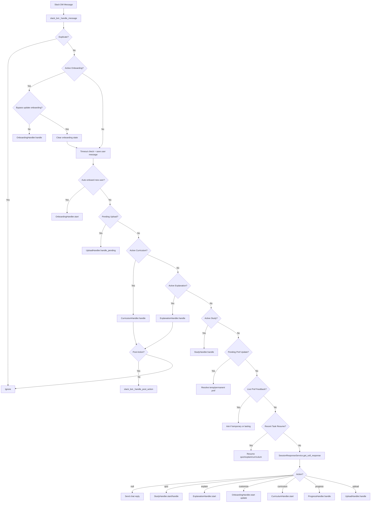

# Sofi System Flow Map

Last updated: 2026-04-03

## Purpose

This document is a plain-English map of how Sofi currently works:

- which handlers exist
- which rules decide where a message goes
- which pieces of state are persisted
- where loops and dead ends can happen
- where to look first when a flow feels wrong

Metaphor:
Sofi is not one brain yet. She is a front desk with several side rooms.
The important debugging question is always:
"Who currently owns the message?"

We need to provide a better system prompt, 
possibly better retreival/context memory separation. 
possibly sub agents
AM

System prompt 
regular context memory. ideally the whole converstaion of that day. Need to see how to implement in slack. should be separate from bot restart. 
compacting context regularly , so that no infromatin is lost. its very important. memory is one of the key features

try to infer user intentions at every step 

we should probably work on routing as the key issue
if intention of user is unclear, sofi should ask 
AM

## Main Entry Point

Primary router:
- [`slack_bot.py`](/Users/amikeda/Smithy/sofi/src/slack_bot.py) - 
this can later be moved to telegram or other service. for context AM

Main method:
- [`_handle_message()`](/Users/amikeda/Smithy/sofi/src/slack_bot.py#L155)

This is the traffic circle of the whole app.
Every user message enters here, and the router decides whether it belongs to:

- onboarding
- upload confirmation
- curriculum
- explanation
- study / quiz
- preference update
- recent-task continuation
- or the general conversational brain

## Handler Inventory

### 1. Onboarding / Customization

File:
- [`onboarding_handler.py`](/Users/amikeda/Smithy/sofi/src/handlers/onboarding_handler.py)

Job:
- first-time setup
- profile update / customization
- save learner profile

Key entry points:
- [`is_active()`](/Users/amikeda/Smithy/sofi/src/handlers/onboarding_handler.py#L128)
- [`start()`](/Users/amikeda/Smithy/sofi/src/handlers/onboarding_handler.py#L144)
- [`handle()`](/Users/amikeda/Smithy/sofi/src/handlers/onboarding_handler.py#L173)

Important state:
- `active_onboardings` in memory
- `onboarding_state.yaml` persisted

Known risks:
- stale update-onboarding can hijack normal conversation if not cleared
- if the model fails to complete, the learner can get trapped in setup mode
- onboarding and general chat can fight over whether the user wants relationship-building or actual work

maybe make a rule that onboarding and customization is optional, so its not a strict 
memory is not saved with this onboarding, or there is some bug there. need to check code carefully
AM

Current protections:
- stale onboarding expiry - how long? it should not stop other handlers being used AM
- `save defaults` - save whenever it seems that a session is finished, if its not then save when user is asking to switch handlers, so that they are always remembering information given. AM
- `cancel setup`
- bypass for explicit lesson/course requests during update-onboarding

### 2. Study / Quiz

File:
- [`study_handler.py`](/Users/amikeda/Smithy/sofi/src/handlers/study_handler.py)

Job:
- start quiz sessions
- ask questions
- grade answers
- save session results

Key entry points:
- [`handle()`](/Users/amikeda/Smithy/sofi/src/handlers/study_handler.py#L38)
- [`_handle_message()`](/Users/amikeda/Smithy/sofi/src/handlers/study_handler.py#L220)

Important state:
- `active_sessions`
- `last_completed_topic`

Known risks:
- quiz mode can swallow messages that were really meta-feedback or mode-switch requests - so first brain thinks what is this correlating with and only then replying AM
- side questions can blur into answer grading
- the session is stateful and easy to confuse if routing order above it is wrong

### 3. Explanation

File:
- [`explanation_handler.py`](/Users/amikeda/Smithy/sofi/src/handlers/explanation_handler.py)

Job:
- walk through topic notes conversationally
- allow follow-up questions
- end naturally or hand off to quiz/customize

Key entry points:
- [`is_active()`](/Users/amikeda/Smithy/sofi/src/handlers/explanation_handler.py#L38)
- [`start()`](/Users/amikeda/Smithy/sofi/src/handlers/explanation_handler.py#L41)
- [`handle()`](/Users/amikeda/Smithy/sofi/src/handlers/explanation_handler.py#L86)

Important state:
- `active_explanations`

Known risks:
- explanation can conflict with curriculum advancement if both try to speak after completion
- vague messages like `continue` can mean "explain more" or "resume previous task"
- previously had note-content extraction bugs

agent should answer context first from memory rag then do web search AM

Current protections:
- curriculum explanations can suppress the automatic "quiz yourself now" prompt

### 4. Curriculum

File:
- [`curriculum_handler.py`](/Users/amikeda/Smithy/sofi/src/handlers/curriculum_handler.py)

Job:
- clarify subject + learner needs
- propose a plan
- build lessons
- keep one or two lessons ahead
- advance after lesson completion

Key entry points:
- [`is_active()`](/Users/amikeda/Smithy/sofi/src/handlers/curriculum_handler.py#L69)
- [`start()`](/Users/amikeda/Smithy/sofi/src/handlers/curriculum_handler.py#L78)
- [`handle()`](/Users/amikeda/Smithy/sofi/src/handlers/curriculum_handler.py#L103)
- [`on_lesson_complete()`](/Users/amikeda/Smithy/sofi/src/handlers/curriculum_handler.py#L120)

Important state:
- `active_curricula`
- `curriculum_state.yaml`
- `curricula/<id>/plan.yaml`

Known risks:
- clarify/approve phases depend on LLM interpretation
- if active, curriculum can intercept messages intended for another mode
- lesson progression depends on completed topic slugs matching exactly

Current protections:
- more forgiving marker parsing
- `cancel curriculum`
- recent-task state can help resume a curriculum intent

### 5. Upload

File:
- [`upload_handler.py`](/Users/amikeda/Smithy/sofi/src/handlers/upload_handler.py)

Job:
- process pasted text or uploaded files
- parse into study notes and questions
- ask where to save when topic match is ambiguous

Key entry points:
- [`handle()`](/Users/amikeda/Smithy/sofi/src/handlers/upload_handler.py#L86)
- [`handle_pending()`](/Users/amikeda/Smithy/sofi/src/handlers/upload_handler.py#L34)
- [`handle_file_upload()`](/Users/amikeda/Smithy/sofi/src/handlers/upload_handler.py#L118)

Important state:
- `pending_uploads`
- `pending_upload.yaml`

Known risks:
- ambiguous replies can be misread
- file processing can produce multiple user-facing messages
- restart used to lose pending confirmation state

### 6. Progress

File:
- [`progress_handler.py`](/Users/amikeda/Smithy/sofi/src/handlers/progress_handler.py)

Job:
- show learning stats

Key entry point:
- [`handle()`](/Users/amikeda/Smithy/sofi/src/handlers/progress_handler.py#L18)

Known risks:
- low complexity, but easy to double-message if chat brain also responds first

## Service Inventory

### General Brain

File:
- [`session_response_service.py`](/Users/amikeda/Smithy/sofi/src/services/session_response_service.py)

Job:
- normal chat response
- choose backend action via JSON
- quiz grading
- topic resolution
- some small-generation helpers

Key entry points:
- [`get_sofi_response()`](/Users/amikeda/Smithy/sofi/src/services/session_response_service.py#L30)
- [`process_message()`](/Users/amikeda/Smithy/sofi/src/services/session_response_service.py#L227)

Important note:
This is where the LLM tries to decide:
- just chat
- quiz
- explain
- customize
- curriculum
- upload
- progress

This is powerful, but fragile.
If this layer misfires, the wrong handler wakes up.

lets make it stronger. would few shot examples help? AM

### Profile

File:
- [`profile_service.py`](/Users/amikeda/Smithy/sofi/src/services/profile_service.py)

Job:
- load profile
- build personalized system prompt
- apply communication settings

We also need her profile. Ideally sofi accesses 3 different folders/domains: tutor model (about herself, system prompt, examples, logic, capabilities, context) user model (often updated info about user and his preferences etc) domain model (that takes info that is being discussed/uploaded and stores is/quizes etc) AM

### Conversation Memory

File:
- [`conversation_memory_service.py`](/Users/amikeda/Smithy/sofi/src/services/conversation_memory_service.py)

Job:
- save recent conversation
- session summaries
- memory context for prompts
- now also stores lightweight system notes in conversation history

Defintetly need to debug this AM

### Data Layer

Files:
- [`local_file_service.py`](/Users/amikeda/Smithy/sofi/src/services/local_file_service.py)
- [`gitlab_service.py`](/Users/amikeda/Smithy/sofi/src/services/gitlab_service.py)

It is not not on gitlab but in collab server AM

Job:
- persist learner data and workflow state

## Current Routing Order

This order matters a lot.
The earlier something is checked, the more likely it is to "steal" a message.

From [`slack_bot.py`](/Users/amikeda/Smithy/sofi/src/slack_bot.py):

1. duplicate-event check
2. active onboarding
3. timeout check + save user message
4. auto-onboarding for truly new users
5. pending upload confirmation
6. active curriculum
7. active explanation
8. active study session
9. pending preference update
10. live preference feedback detection
11. recent-task continuation
12. general chat brain (`get_sofi_response`)
13. handler launch based on chosen action

Onboarding needs to happen just once, not every session. If complete then skip. 
what is duplicate event?
Lets think of alternative model for this, not sequential. 
general chat brain should be first, as orchestrator (maybe a separate agent that bring in other subagents?)
AM

## Persisted State Map

These files are the hidden memory of the machine.

- `profile.yaml`
  Learner profile and customization settings

- `onboarding_state.yaml`
  In-progress onboarding/update conversation

  onboarding should contribute to profile directly, not a separate thing AM

- `pending_upload.yaml`
  Waiting-for-confirmation upload state

- `curriculum_state.yaml`
  In-progress curriculum conversation state

- `curricula/<id>/plan.yaml`
  Actual curriculum plan and lesson progression

- `conversation.yaml`
  Recent conversation buffer

- `recent_task_state.yaml`
  Small explicit memory of the last major task
  need to define memory window? AM

- `memory.yaml`
  Longer-term summaries / psychological observations
  When do they happen? needs to be regular AM

## Main Loops And Failure Patterns

### Loop 1. Stale Update-Onboarding Hijack

Pattern:
- user had profile update flow open
- `onboarding_state.yaml` remained
- every message got routed back into onboarding
- user asked for lesson/course info
- Sofi kept asking setup questions

Why it happens:
- onboarding was checked first
- stale update state looked like "active work"

Current status:
- partially fixed with stale-state expiry and bypass logic

### Loop 2. LLM Marker Fragility

Pattern:
- handler waits for exact marker like `PROFILE_COMPLETE:` or `CURRICULUM_CLARIFIED:`
- LLM slightly drifts
- flow silently continues instead of progressing
dont understand this issue. Profiles can be constantly updated, and even if there is a little bit there, it can already complete for now and then update AM

Current status:
- parsing made more forgiving
- still somewhat LLM-dependent

### Loop 3. Action Misfire

Pattern:
- general chat brain reads messy history
- picks `curriculum` or `customize` from vibes, not latest intent
- wrong handler launches

Current status:
- partially reduced with deterministic action guardrails
Few shot in system prompt? it shouldnt decide based on just seeing one word AM

### Loop 4. Vague Follow-Up Drift

Pattern:
- user says `continue`
- no active handler owns it
- chat brain guesses what `continue` means
- Sofi resumes the wrong thing or says something generic

Current status:
- improved with `recent_task_state`
- still requires live testing
Continue usually means - have next step in the process that we were doing before. so check memory AM

### Loop 5. Competing Messages

Pattern:
- chat brain responds
- handler also responds
- user sees duplicate/conflicting answers

Current status:
- reduced for `progress`, `upload`, and curriculum-linked explanation endings

there needs to be one orchestrator AM

### Loop 6. Curriculum / Explanation / Quiz Cross-Talk

Pattern:
- one flow ends
- another flow auto-announces
- user receives two incompatible "next step" suggestions

Current status:
- improved, not fully eliminated

## Flow Diagram

## Ownership Rules

When debugging a weird message, ask these in order:

1. Was there persisted state already active?
2. Which handler had first right of refusal?
3. Did the message contain a clear explicit task request?
4. Did a vague reply get interpreted using stale history?
5. Did both the general brain and a handler speak?

## Where I Would Look First For Mistakes

### If Sofi asks irrelevant setup questions

Look at:
- [`slack_bot.py`](/Users/amikeda/Smithy/sofi/src/slack_bot.py)
- [`onboarding_handler.py`](/Users/amikeda/Smithy/sofi/src/handlers/onboarding_handler.py)
- `onboarding_state.yaml`
- `profile.yaml`

### If Sofi launches the wrong mode

Look at:
- [`session_response_service.py`](/Users/amikeda/Smithy/sofi/src/services/session_response_service.py)
- action guardrails
- recent-task state

### If `continue` feels cursed

Look at:
- `recent_task_state.yaml`
- [`slack_bot.py`](/Users/amikeda/Smithy/sofi/src/slack_bot.py)
- whether any handler is still active

### If two replies appear or suggestions conflict

Look at:
- `HANDLER_OPENS` logic in [`slack_bot.py`](/Users/amikeda/Smithy/sofi/src/slack_bot.py)
- handler-specific `say(...)` calls after endings

### If curriculum progression feels wrong

Look at:
- `curriculum_state.yaml`
- `plan.yaml`
- topic slug matching in curriculum completion hook

## My Engineering Opinion

Should you rebuild from scratch right now?

Not yet.

Why:
- the current code is messy, but it is now mapped
- several real bugs were architectural, not random
- a full rewrite before you fully understand the failure modes usually recreates the same ghosts in prettier wallpaper

A smarter version of "start over" would be:

1. freeze this codebase
2. use this map to identify the real responsibilities
3. design a smaller v2 architecture
4. re-implement only after the routing/state model is clean on paper

Metaphor:
Do not bulldoze the house while you are still discovering which rooms actually exist.
Draw the floor plan first. Then decide whether to renovate or rebuild.

## Good V2 Shape

If you later rebuild, I would aim for:

- one explicit router
- one explicit conversational state object
- one learner profile object
- handlers that return structured events, not freeform surprises
- fewer LLM-dependent control-flow decisions
- natural-language generation separated from routing/state decisions

That would make Sofi less magical and more trustworthy.
