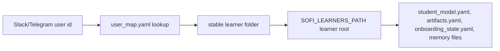

# Sofico Working Context

Last updated: 2026-04-21

## Purpose

This document is the running memory for Sofi work in this chat/project.
It should help future sessions answer:

- What are we trying to build?
- What feels broken right now?
- What has already been investigated or changed?
- What should happen next?

Think of this file as the ship's logbook. Code is the engine room; this document records where we were sailing, what broke, and which repairs were already attempted.

## Project Snapshot

Sofico is a conversational learning companion that lives in Slack.
Core modes in the current codebase:

- General conversational routing through `src/slack_bot.py`
- Quiz / study sessions through `src/handlers/study_handler.py`
- Explanation sessions through `src/handlers/explanation_handler.py`
- Onboarding / customization through `src/handlers/onboarding_handler.py`
- Upload and study-document generation through `src/handlers/upload_handler.py`
- Curriculum generation through `src/handlers/curriculum_handler.py`

Naming note:

- V2 product name is `Sofico`
- older code/docs may still contain `Sofi`
- cleanup is tracked as a future cross-cutting milestone because renaming internals should be done carefully and tested

Main problem observed by user:

- Sofi does not consistently feel like a good conversational agent
- Some flows lead to dead ends, handler traps, or repeated prompts
- Parts of the system feel brittle instead of smooth and companion-like

## Problems Found So Far

### Confirmed flow bugs

- Active curriculum flow could trap the user in a loop:
  the bot said "say explain it" or "say quiz me", but curriculum mode intercepted those messages and did not hand off to the real explanation or quiz handlers.

- Explanation mode could end up using bad note context:
  the explanation flow was slicing note content in a way that could strip away the actual study material and leave mostly frontmatter/title content.

- Upload confirmation had a dead-end risk:
  a pending upload reply was popped immediately, so an ambiguous answer could consume the pending state and force the user to start over.

- Onboarding confirmation had an argument mismatch:
  the confirmation generator was being called with the wrong positional argument, which could produce the wrong teaching voice in the confirmation message.

### Structural pain points

- Too much routing logic depends on LLM interpretation for basic control flow.
- Multiple active modes compete for ownership of the same incoming message.
- The system often tells the learner to use a phrase, but there is not always a reliable handler path behind that phrase.
- Conversational warmth and state continuity are still weaker than they should be.

## Changes Made In This Chat

These code changes were already applied before the new "ask before editing" rule was added to global Codex instructions.

### Flow and handler fixes

- Updated `src/slack_bot.py`
  so active curriculum and explanation handlers can return a follow-up action and properly hand off to the next mode.

- Updated `src/handlers/curriculum_handler.py`
  so active curriculum mode can launch explanation or quiz on the current lesson instead of only repeating instructions.

- Updated `src/handlers/explanation_handler.py`
  so it keeps the actual note content and returns end/quiz/customize actions with topic context.

- Updated `src/handlers/upload_handler.py`
  so ambiguous upload-confirmation replies do not destroy pending state, and `cancel` works.

- Updated `src/handlers/onboarding_handler.py`
  so onboarding confirmation uses persona/archetype arguments correctly.

- Updated `src/services/session_response_service.py`
  so upload-topic parsing can return `unclear` instead of silently falling into the wrong save decision.

- Updated `src/services/local_file_service.py`
  and `src/services/gitlab_service.py`
  so topic-note retrieval strips YAML frontmatter more safely for explanation/RAG use.

### Validation performed

- Ran `python3 -m compileall /Users/amikeda/Smithy/sofi/src`
- Result: compile check passed

## Current Build Direction

Current approved build focus:

- Make Sofi more conversation-first
- Improve customization without overwhelming the learner
- Keep the existing architecture where possible instead of rebuilding from scratch
- While discussing architecture/design in this project, explain ideas more fully and label recommendations clearly as suggestions.
- Use proper software terms during Sofi architecture work, but explain each term at least once when introducing it so the user can learn the standard language.
- During long design or implementation sessions, add short summary checkpoints at meaningful milestones so project context stays usable.

### Deployment Storage Rule

All student material should live on the pod in production.

Meaning:

- the pod's learner volume is the production source of truth
- `SOFI_LEARNERS_PATH` must be treated as the canonical learner root in deployed environments
- local learner files are for development and smoke testing only
- student-specific files should not be committed unless they are deliberate fixtures or migration examples

Required learner-data path flow:

Why this matters:

- if one store writes to repo-local `learners/` and another reads from `/app/learners`, Sofico behaves like she has amnesia
- all learner-facing systems must use the same storage contract before we trust restart behavior
- future memory/artifact tests must simulate the pod path, not only local repo paths

### V2 restructure direction

Agreed direction now:

- preserve existing spaced repetition, parsing, explanation, and curriculum logic as much as possible
- restructure rather than inventing a whole new product
- build a clean orchestration subsystem above the current handlers/services
- make `CurrentFocus` and `StudyArtifact` explicit first-class models
- stop at each milestone, test, then continue
- use `planning/sofi-v2-implementation-phases.md` as the main milestone plan
- keep milestone 1 practical and shippable
- move richer dreaming, compaction, and advanced retrieval depth into later milestones unless a smaller version is required for the first working brain
- include a simple reflection pass and structured student-memory updates in milestone 1 because they are part of Sofi feeling temporally coherent
- split V2 bootstrap/personality layers into:
  - `SOUL.md` for core self
  - `IDENTITY.md` for presentation/persona
  - `TEACHING.md` for instructional method
- V2 product name: `Sofico`

### V2 milestone checkpoint

Milestone 1 completed:

- created `src/orchestrator/`
- added core models:
  - `TurnContext`

### Sofico live-slice direction

Current product direction has shifted from foundation-first milestones to agile working slices.

Agreed rule:

- do not build on the old onboarding handler for the new user path
- use the new `Sofico` path for first-time setup
- prefer a small end-to-end working slice over another abstract architecture milestone

Current first live slice:

- new user arrives
- orchestrator selects `onboard_user`
- new `SoficoOnboardingFlow` asks 4 structured questions
- answers persist into `learners/<user>/student_model.yaml`
- after onboarding, learner can upload material and get notes + study questions

Local testing support added:

- `chat.py` is now a real local integration harness instead of onboarding-only
- it loads `.env` automatically, matching the main app bootstrap behavior
- it routes turns through the new orchestrator and shows the selected capability
- it executes these local capability paths:
  - `onboard_user`
  - `converse`
  - `explain`
  - `ingest_material`
- it supports `/paste` multiline input for local material ingestion

Known local-testing caveat:

- inside the Codex sandbox, outbound model calls can fail with connection errors even when the code path is correct
- so `compileall` and local routing were verified here, but full Anthropic-backed replies still need to be tested on the user's own terminal environment

Inner continuity addition:

- added `src/orchestrator/self_model/SELF_MODEL.md`
- added `src/orchestrator/self_model/DREAMING.md`

Current agreed distinction:

- `SOUL.md` = stable identity
- `SELF_MODEL.md` = conscious self-observation
- `DREAMING.md` = offline synthesis / dreaming-lite

Current status:

- docs are in place
- not yet plugged into runtime behavior
- should be treated as the next reflective/self-improvement layer, not as prompt decoration

Implementation status:

- `onboard_user` capability added to capability registry
- `SoficoOnboardingFlow` added under `src/orchestrator/`
- `slack_bot.py` now routes new/unconfigured users into the new onboarding flow before old onboarding logic
- file uploads are blocked until the quick Sofico onboarding is complete
- runtime smoke test passed for:
  - orchestrator selecting `onboard_user`
  - onboarding completion persisting student model fields
  - orchestrator switching from `onboard_user` to `converse` after setup
  - `CurrentFocus`
  - `StudyArtifact`
  - `ConversationState`
  - `OrchestratorResult`
- added `SofiOrchestrator` scaffold
- compile test passed
- import smoke test passed

This milestone is foundation only. Nothing is wired into live Slack flow yet.

Milestone 1B completed:

- added runtime teacher bootstrap file at `src/orchestrator/bootstrap/SOUL.md`
- added `src/orchestrator/student_model.py` with:
  - `StudentModel`
  - `StudentMemoryEntry`
  - `StudentMemoryUpdate`
  - `StudentMemoryDecision`
  - `StudentModelStore`
- added `src/orchestrator/bootstrap_loader.py`
- taught `SofiOrchestrator` to load teacher soul + student model bootstrap context
- verified `ADD / UPDATE / NOOP` semantics in smoke testing, with `UPDATE` preserving history by marking the prior belief as `superseded`

This is the first working slice of V2 memory identity. It still is not wired into live tutoring behavior yet.

Bootstrap identity/teaching files now also exist:

- `src/orchestrator/bootstrap/SOUL.md`
- `src/orchestrator/bootstrap/IDENTITY.md`
- `src/orchestrator/bootstrap/TEACHING.md`

These are still static bootstrap files for now. They are not yet loaded into the live Slack tutoring flow.

Student profile documents now also exist:

- `src/orchestrator/student_profile/STUDENT_MODEL.md`
- `src/orchestrator/student_profile/student_model.yaml`

These define the readable and structured student-model views separately from the teacher bootstrap files.

Bootstrap loader checkpoint:

- `src/orchestrator/bootstrap_loader.py` now loads:
  - `SOUL.md`
  - `IDENTITY.md`
  - `TEACHING.md`
  - the per-learner student model
- identity and teaching files now have lightweight structured-default parsing
- orchestrator bootstrap context now exposes all four layers for milestone testing

Capability registry checkpoint:

- added `src/orchestrator/capability_registry.py`
- defined 8 first-pass capabilities:
  - `converse`
  - `explain`
  - `ingest_material`
  - `create_study_artifacts`
  - `plan_study`
  - `review`
  - `show_progress`
  - `research`
- each capability now has:
  - purpose
  - user intents
  - inputs
  - reads/writes
  - code-path mapping
  - artifact/research flags
- orchestrator now exposes the registry instead of a placeholder capability summary

Teacher model + artifact checkpoint:

- added `src/orchestrator/bootstrap/teacher_model.yaml` as the structured teacher system view
- bootstrap loader now loads:
  - `SOUL.md`
  - `teacher_model.yaml`
  - `IDENTITY.md`
  - `TEACHING.md`
  - the per-learner student model
- added `src/orchestrator/artifact_store.py`
- `StudyArtifactType` now reflects the cleaner domain set:
  - `uploaded_source`
  - `notes`
  - `question_set`
  - `course_plan`
  - `lesson_material`
- artifact store can now persist and query learner artifacts by type and topic

Milestone 1 completion checkpoint:

- upload pipeline now registers artifacts:
  - uploaded source
  - notes
  - question set
- curriculum pipeline now registers artifacts:
  - course plan
  - lesson material
  - linked question set
- added `src/orchestrator/reflection_engine.py`
- reflection V1 can now turn structured session evidence into student-model updates
- orchestrator now has a first decision loop that selects a capability instead of always returning a pure scaffold result
- added `src/orchestrator/context_view.py`
- stored history is now explicitly separated from the reduced LLM-facing context view

Milestone 1 is now practically complete:

- teacher model exists in readable + structured form
- student model exists in readable + structured form
- domain knowledge now has a first artifact registry
- capability registry exists
- reflection V1 exists
- context-view separation exists
- first decision loop exists

What is still intentionally rough:

- the decision loop is heuristic, not a full classifier
- reflection is lightweight, not yet dreaming/deep synthesis
- live Slack traffic is not yet routed through the new orchestrator

### Customization direction agreed in chat

- Use a **quick + advanced** model
- Default Sofi should be calm, intelligent, and concise
- Default proactivity should be medium
- Persona should affect everything, not just chat tone
- Wordiness, theatricality, and proactivity should be adjustable
- If a learner says something like "you're talking too much," Sofi should treat it as a co-design signal and clarify whether the change is temporary or permanent

### Implementation started

First implementation pass:

- expand profile schema with advanced communication controls
- update onboarding to collect those controls optionally
- thread those controls into main prompting so they affect behavior

Second implementation pass:

- add live preference tuning during normal conversation
- if a learner says something like "you're talking too much", Sofi should ask whether the change is temporary or lasting
- temporary overrides should affect the active conversation immediately

Third implementation pass:

- thread temporary preference overrides into active quiz feedback and explanation sessions
- make study session openings and closings read the same communication-style settings
- move live preference detection ahead of active study/explanation routing so tutor-style feedback is not swallowed as quiz input
- narrow preference detection phrases so topic requests like "go deeper" are less likely to be mistaken for persona edits

Fourth implementation pass:

- make onboarding marker parsing more forgiving so `PROFILE_COMPLETE` can still be recovered if the LLM wraps it in extra text or code fences
- make curriculum marker parsing more forgiving for `CURRICULUM_CLARIFIED` and `OUTLINE_UPDATED`
- add escape hatches for stuck onboarding/curriculum flows so the learner can cancel or finish with defaults instead of looping forever
- persist pending upload confirmation state so a bot restart does not forget an in-progress upload decision

Fifth implementation pass:

- fix update-onboarding hijacking: persisted onboarding update state no longer gets to trap unrelated lesson/course requests indefinitely
- make onboarding state expire after a short session window instead of resurrecting forever
- teach update-onboarding to respect the existing profile name instead of re-asking for it
- preserve existing profile metadata during updates instead of overwriting everything as if this were a first-time setup

Sixth implementation pass:

- stop the general chat brain from falsely claiming it has no memory or that every conversation starts fresh
- strengthen chat-mode instructions so existing learner profiles do not trigger re-onboarding behavior
- make the latest user request outrank stale setup chatter in the shared conversation history

Seventh implementation pass:

- add deterministic action guardrails so high-impact actions like `customize`, `curriculum`, `upload`, and `progress` only fire from the latest message when the learner clearly asks for them
- prevent vague replies like `continue` from launching a new curriculum or other mode out of stale context
- stop curriculum launch if no subject was actually provided, instead of using the raw user utterance as the subject

Eighth implementation pass:

- add lightweight internal breadcrumbs to conversation history so the chat brain can anchor vague follow-ups like `continue` to the most recent real task
- record recent high-level intent when Sofi launches quiz, explanation, customization, or curriculum flows
- tell the general chat brain to treat those breadcrumbs as reliable context instead of improvising from stale history alone

Ninth implementation pass:

- add a small explicit `recent_task_state` persistence layer so vague follow-ups can resume the last real task deterministically
- clear that state on timeout and expire it automatically after a short window
- route `continue`/`go on`/`keep going` through recent-task resumption before handing off to the general chat brain

Tenth implementation pass:

- suppress duplicate/conflicting preambles for `progress` and `upload` actions so the chat brain and handler do not both answer the same request
- suppress the post-explanation "quiz yourself now" prompt when an explanation just completed as part of an active curriculum lesson, so it does not conflict with the next-lesson message

Eleventh implementation pass:

- split Slack message handling into `raw_text` and `normalized_text`, so original user casing now survives into memory, name capture, and LLM calls instead of being lowercased at the front door
- broaden passive name capture so bare replies like `Annita` can be recognized as names during onboarding and general chat
- add runtime profile guards in `src/services/profile_service.py` so malformed values like noisy `persona_description`, invalid motivation enums, or broken communication settings fall back safely instead of poisoning prompts
- add stale-state notices plus silent cleanup hooks for onboarding and curriculum, so expired state can be cleared and explained at the router boundary
- add curriculum TTL/validity checks, including persisted-state sanity checks for missing subject, invalid phase, or broken active plans
- replace curriculum active exact-match commands with intent families and lesson-aware clarifiers, so replies like `continue`, `start`, and lesson questions no longer fall into the same canned loop
- add a shared active-mode shift helper in `src/slack_bot.py` so explicit switches can leave onboarding/explanation/quiz immediately while ambiguous nudges get a brief clarifier instead of a bad guess
- add lightweight cancellation helpers for explanation and quiz sessions so active-mode switches do not leave old session state hanging around
- expand explicit explain-intent detection in `src/services/session_response_service.py` for lesson-style phrasing like `give me the lesson` or `start the lesson`
- relax some exact-match traps in onboarding, curriculum cancel flow, and pending preference-update confirmations so natural phrasing is accepted more often

## Current Risks / Unknowns

- We have not yet done a full live Slack end-to-end test of the repaired flows.
- There may still be conversational awkwardness even when handlers are technically correct.
- Curriculum generation and general chat still rely heavily on LLM prompting rather than strong deterministic guardrails.
- Curriculum mode still has harder-coded tone than chat, study, and explanation, so "persona affects everything" is improved but not fully finished yet.
- Profile corruption can now be filtered at runtime, but existing learner files may still contain wrong values like incorrect names; batch 1 guards the prompt layer but does not rewrite saved profiles automatically.
- The repo currently has unrelated local changes in learner data/state files, so care is needed not to overwrite personal runtime data.
- Escape hatches now exist, but we still need manual Slack testing to see whether the new stuck-flow prompts feel natural rather than abrupt.
- We still need to watch for accidental `customize` action misfires from the general chat brain, but task requests can now bypass an active update-onboarding trap.

## Suggested Next Testing Pass

Manual test these flows in Slack:

1. Start a curriculum, then say `explain it`
2. Start a curriculum, then say `quiz me`
3. Finish one curriculum lesson and confirm the next lesson advances
4. Upload a document that triggers topic confirmation, then reply ambiguously
5. Run a normal open-ended conversation and note where Sofi feels robotic or menu-like
6. During active curriculum, try `continue`, `ok`, `start`, and a lesson question like `what is this lesson about?`
7. During an active quiz or explanation, ask to switch tasks in natural language and confirm the old mode does not cling on
8. Confirm a stale curriculum or onboarding file now expires with a short explanation instead of silently hijacking the next session

## Improvements To Prioritize Next

### 1. Make conversational mode a first-class mode

Right now Sofi often feels like a switchboard operator connecting cables between handlers.
She needs a stronger "companion brain" that can:

- answer directly
- stay with the user's emotional tone
- only trigger task handlers when the user clearly wants them

### 2. Reduce "instructional menu voice"

Too many responses tell the learner what to type next.
That makes Sofi feel more like a kiosk than a tutor.
Where possible, handlers should accept natural replies instead of requiring magic phrases.

### 3. Add lightweight state maps for active modes

Each active mode should clearly declare:

- what messages it owns
- what messages should escape to general conversation
- what exit/handoff actions it can return

This is like traffic signage at an intersection. Right now too many roads have no signs.

### 4. Add scenario-based tests for routing

The fragile part of Sofi is not syntax; it is conversation flow.
Tests should cover message-routing stories, not just utility functions.

Example scenarios:

- user starts curriculum, then asks to explain current lesson
- user is in explanation mode, then wants to quiz
- user gives unrelated reply during upload confirmation
- user says something emotional while not in a study session

## Working Rules For Future Sessions

- Ask before making code changes
- Explain steps in plain language for learning
- Use metaphors when helpful
- Keep this file updated as work progresses
- For memory/onboarding/identity persistence work, never claim the fix is done until the returning-user path is tested through canonical learner mapping (`learners/user_map.yaml`) and restart behavior. Component-only tests are not enough; verify the real Slack/Telegram user path after restart.

## 2026-04-21 Persistence Failure Postmortem

- Bug: Sofico re-onboarded Anna after restart even though learner data existed.
- Root cause: the V2 stores did not share the same learner-root contract as `LocalFileService`. In the pod, `LocalFileService` used `SOFI_LEARNERS_PATH=/app/learners`, while `StudentModelStore` and `ArtifactStore` derived paths from code layout and could point at `/learners` or another wrong root. The V2 stores also needed to respect `learners/user_map.yaml` so Slack IDs like `U08CZDXTD50` resolve to stable learner folders like `anna`.
- Process failure: the fix was validated against isolated student-model/onboarding components, not against the real returning Slack user path after restart.
- Prevention rule: all learner memory, onboarding, profile, artifact, and current-focus paths must resolve through `SOFI_LEARNERS_PATH` first, then through one canonical learner-folder mapping. If a legacy `profile.yaml` exists, V2 must import/respect it instead of treating the learner as new.
- Smoke test requirement: for any memory/onboarding/artifact change, test with `SOFI_LEARNERS_PATH` set to a temporary learners root, a `user_map.yaml` entry, and a wrong `project_root`; confirm all writes still go to the env learners root and mapped folder. Also test at least one mapped Slack user and one profile-backed learner and confirm `needs_onboarding=False` and `active_onboarding=False`.

## 2026-04-21 Conversational Orchestrator Correction

- Bug: Sofico accepted `hi` as the learner name, then accepted `what is my name` as the study subject. This made onboarding corrupt the student model and made the bot feel scripted rather than conversational.
- Root cause: the new `SessionController` trusted active onboarding state before checking whether the persisted student model was already complete. Onboarding also lacked validation guardrails for obvious greetings and questions.
- Design correction: student model completeness now outranks stale onboarding state. If the learner model is complete, the controller clears onboarding state before routing the turn. Onboarding now rejects greetings/questions as setup answers instead of saving them.
- Slack fallback correction: legacy Slack routing and file-upload routing now also clear stale Sofico onboarding state when the student model is complete.
- Smoke test run: `SOFI_LEARNERS_PATH=/tmp/sofico_orchestrator_smoke` with `user_map.yaml`, a wrong `project_root`, a legacy `profile.yaml`, and stale `onboarding_state.yaml`; confirmed onboarding clears and writes/imports through the env learner root. Also confirmed `hi` and `what is my name` do not advance onboarding.
- Architectural rule: there must be one conversational front door. Active workflows can own a message only after the controller verifies they are still valid for the current persisted learner state.

## 2026-04-21 Artifact Awareness Slice

- Built: added `show_artifacts` as a read-only capability so Sofico can answer questions like `what did you create?`, `what questions did you make?`, `show my notes`, and `what have we uploaded recently?`.
- Reused existing storage: topic notes still come from saved Markdown study documents, and questions still come from `_index.yaml`. No new artifact format was invented.
- Runtime behavior: current-focus artifact questions summarize the focused topic's notes and question counts; recent/upload overview questions list visible study topics/artifacts.
- Smoke test run: with Anna's local `ai-consciousness` topic focused, `what did you create?` and `what questions did you make?` returned notes plus 29 indexed questions; `what have we uploaded recently?` returned a workspace-level topic overview.
- Remaining limitation: older materials may not have `artifacts.yaml` entries, so the overview falls back to topic folders. This is acceptable for now because the source of truth remains the saved notes and `_index.yaml`.

## 2026-04-21 Pending Upload Conversation Fix

- Bug: during upload topic confirmation, Sofico treated `what do you think? is it the same topic?` as an invalid save-location answer and repeated the form prompt.
- Root cause: pending upload confirmation owned every message but had no conversational sub-route for relevant meta-questions.
- Fix: `SessionController` now detects topic-comparison questions while an upload is pending, gives a recommendation using the pending document topic/tags and existing topic notes, and keeps the pending save active.
- Safety fix: `UploadHandler.handle_pending` now handles obvious `yes`/`no` replies deterministically before calling the LLM parser, so simple confirmations do not fail when the model parser is unavailable.
- Smoke test run: fake pending upload for `micropsi-motivational-architecture` vs existing `psi-cognitive-architecture`; `what do you think?` produced a merge recommendation while keeping pending state, then `yes` saved the document and updated `_index.yaml`.

## 2026-04-21 Upload-To-Explain Handoff Fix

- Bug: after saving a newly uploaded article, `first explain` continued an old explanation/quiz context instead of explaining the new article. Follow-up wording like `from the article I just gave you` could trigger paste capture instead of using the saved article.
- Root cause: successful upload save updated files but did not reliably clear stale active learning modes before setting current focus. Bare explain commands also did not bind to current focus unless they contained `this`/`it`/`article`.
- Fix: successful ingest/save now clears active quiz/explanation modes and makes the saved topic the current focus. Bare commands like `first explain` now bind to current focus. Current-material references like `from the article I just gave you` no longer start paste capture when focus exists.
- Safety fix: exact topic matching in `SessionResponseService.resolve_topic` is deterministic before any LLM fuzzy match.
- Smoke test run: pending save to `new folder - consciousness` cleared stale `old-topic` explanation, set focus to `consciousness`, made `first explain` start explanation for `consciousness`, and did not enter paste mode for `what about from the article I just gave you?`.

## 2026-04-21 Memory Recall Slice

- Built: added deterministic `recall_context` capability for questions like `what were we doing?`, `where did we leave off?`, and `what was I studying?`.
- Storage used: `recent_task_state.yaml` now keeps a short activity breadcrumb plus current focus. `memory.yaml` remains the longer session-summary layer.
- Runtime behavior: after restart, Sofico can answer from saved focus/activity instead of asking the learner to repeat context.
- Smoke test run: saved focus/activity for `consciousness`, created a fresh `SessionController`, asked `what were we doing?`, and received the saved topic, document, question count, and continuation options.
- Design rule: short-term continuity should not depend on an LLM call. The controller must remember the current work item deterministically.

## 2026-04-22 Onboarding / Artifact Source-Of-Truth Fix

- Bug: on pod restart, deleting `student_model.yaml` did not force clean onboarding because V2 immediately re-imported stale legacy `profile.yaml` data such as `learner_name: Anita`, then treated the imported model as complete.
- Bug: stale `onboarding_state.yaml` could still own messages mid-flow, so greetings or normal questions could be interpreted as setup answers.
- Bug: material inventory questions such as `what materials do I have available?` and `what other papers do you have?` were routed to converse/explain/upload paths instead of the artifact listing path.
- Bug: `LocalFileService.get_topic_notes()` reused `parts` for both the collected-note list and YAML frontmatter split, so multi-document topic notes could be corrupted or partially hidden.
- Fix: legacy profile imports are now marked `requires_v2_onboarding: true` and only models with `onboarding_completed_at` pass V2 onboarding. Completed onboarding clears that flag and syncs the learner name back into `profile.yaml` so old handlers do not keep using stale names.
- Fix: onboarding state files now include a flow version. Missing/old versions are discarded, which prevents stale partial setup from hijacking current messages.
- Fix: artifact/material inventory requests now route deterministically to `show_artifacts`, and workspace listings show each topic with notes/question counts. Specific topic requests still resolve to that topic.
- Smoke test run: temporary pod-like `SOFI_LEARNERS_PATH`, stale `profile.yaml` with `Anita`, completed onboarding with `Anna`, stale unversioned onboarding state, and four topic folders. Confirmed onboarding runs, both V2 and legacy profile use `Anna`, stale state is deleted, all four topics list, and missing `electromagnetism` is reported as not found.
- Design rule: imported legacy state may be used as seed data, but it must never be treated as proof that V2 onboarding is complete.

## 2026-04-22 Duplicate Upload And Quiz Handoff Fix

- Bug: exact re-upload of the same study document could overwrite the Markdown file, leave the question index unchanged, and still register duplicate artifact entries. The learner then saw the same paper listed multiple times.
- Bug: upload completion text always said `Created/Added N questions` based on generated questions, not the actual number inserted into `_index.yaml`.
- Bug: while an explanation session was active, `quiz me` could leak a backend handoff message instead of cleanly starting review.
- Fix: `UploadHandler` now treats an exact existing `topic/doc_name.md` plus already-indexed question IDs as a duplicate and skips saving notes, adding questions, and registering artifacts.
- Fix: `_update_index_via_service` now returns the actual inserted question count, so messages and artifact metadata reflect what was really added.
- Fix: explanation action `quiz` now starts the review session through `StudyHandler` instead of reporting the handoff.
- Smoke test run: first upload of `consciousness/em-field-consciousness.md` created one indexed question and three artifact records; second exact upload stayed at one question and three artifacts and returned `status: duplicate`.
- Design rule: `_index.yaml` is the internal Anki-style card source of truth. Markdown stores readable notes and answers; `_index.yaml` stores review scheduling fields used by SM-2.

## 2026-04-22 Orchestrator-First Active Mode Fix

- Bug: active explanation/quiz modes could capture a learner message before the orchestrator classified it. Example: `can you give me recall questions?` during explanation was treated as an explanation follow-up instead of a quiz request.
- Fix: `SessionController.handle_input` now asks the orchestrator for capability first, then lets active modes continue only when the new message is ordinary conversation for that mode.
- Fix: review-category requests such as `recall questions`, `apply questions`, `explain questions`, and `connect questions` route to `review`.
- Fix: `StudyHandler` can filter a new quiz session by question category, so `can you give me recall questions?` starts a Recall-only review when due Recall cards exist.
- Fix: document ingestion now generates a `## Learning Notes` section before `## Anki Questions`, preserving the existing parsing boundary while making notes more structured and learner-readable.
- Smoke test run: orchestrator selected `review` for `can you give me recall questions?`, `show_artifacts` for `what questions did you make?`, and a fake active explanation no longer captured a recall-question request.
- Design rule: the orchestrator is the front door. Active workflows are rooms; they should not own a message until the front door has checked whether the learner is asking to switch rooms.

## 2026-04-22 Document-Level Artifact Lookup Fix

- Bug: Sofico could list a saved paper in `show_artifacts`, then deny seeing it in normal conversation because conversation prompts only received topic names and truncated topic notes.
- Example: `how about electromagnetism` should resolve to the saved Ward & Guevara electromagnetic-field paper, not ask whether this is a new direction.
- Fix: `SessionController` now checks saved artifact titles, source paths, source labels, and doc names for meaningful query terms before letting ordinary conversation or active explanation continue.
- Fix: long technical words get lightweight prefix matching, so `electromagnetism` can match `Electromagnetic`.
- Fix: folder follow-ups like `there is another paper in that folder` use the current focused topic and show document-level entries in that topic.
- Smoke test run: `how about electromagnetism` and `ward is it do you not see in the title` both found the Ward & Guevara artifact; `there is another paper in that folder` listed both Ward & Guevara and Abstraction Fallacy under `consciousness`.

## 2026-04-22 OpenClaw-Style Architecture Pivot

- Decision: stop treating Slack behavior as the core architecture. Slack is only a transport adapter.
- Direction: rebuild Sofico around an OpenClaw-style runtime, context engine, LLM turn interpreter, deterministic executors, and persistence loop.
- Reason: deterministic keyword routing cannot provide Claude-like conversational fluidity. It creates endless exceptions for natural human speech.
- Principle: the LLM interprets the learner's meaning; deterministic code executes reality against files, memory, cards, uploads, and safety checks.
- Updated `planning/sofi-v2-milestones.md` so the next milestones are:
  - Runtime Foundation
  - Context Engine V1
  - LLM Turn Interpreter
  - Agent Loop V1
  - Capability Executors
  - Artifact Memory And Document Graph
  - Learning Notes And Review Cards
  - Transport Adapters
  - Inner Continuity
- Existing pieces to preserve: bootstrap files, student model, capability registry, artifact store, current focus, memory, upload parser, explanation handler, SM-2 review handler, progress handler.
- Next implementation target: Context Engine V1 followed immediately by LLM Turn Interpreter in shadow mode.

## 2026-04-22 Context Engine And Turn Interpreter V1

- Built: `src/orchestrator/context_engine.py` with OpenClaw-style lifecycle methods: `ingest`, `assemble`, `compact`, and `after_turn`.
- Context packet now includes: turn, runtime metadata, learner summary, teacher summary, focus, active workflows, recent messages, topics, document/artifact titles, capabilities, and summary notes.
- Added document listing support to both `LocalFileService` and `GitLabService` so the context engine can see all Markdown documents in a topic folder.
- Built: `src/orchestrator/turn_interpreter.py` with `TurnDecision` and `TurnInterpreter`.
- Interpreter mode is controlled by `SOFICO_TURN_INTERPRETER_MODE`: `shadow` by default, `active` to let high-confidence LLM decisions override deterministic routing, or any other value to avoid calling it.
- Shadow mode stores both deterministic capability and LLM turn decision in orchestrator metadata. It does not change execution yet.
- Active workflow bridge added: `SessionController` now supplies onboarding, pending upload, explanation, review, and paste-capture state to the context engine before interpretation.
- Smoke tests run locally without API key: context packet includes both documents under `consciousness`; active explanation state reaches the context packet; interpreter falls back safely when no LLM key is configured.

## 2026-04-22 Document-Grounded Answer Executor

- Bug: with `SOFICO_TURN_INTERPRETER_MODE=active`, Sofico could still answer a Ward/electromagnetism question from the Lerchner notes, or just list matching artifacts. The LLM interpreter could choose a better capability, but the executor still lacked a path for "answer from this matched document."
- Fix: `SessionController` now tries a document-grounded answer before active explanation/review continuation and before artifact listing. If the learner asks a content question and saved artifacts match the wording, Sofico loads that exact study document's notes and answers from them.
- Fix: `LocalFileService` and `GitLabService` now expose `get_study_document_notes(user_id, topic, doc_name)` so execution can retrieve one document, not the whole topic folder.
- Fix: artifact matching now ignores question-set artifacts for document lookup and scores uploaded sources/notes by title, source label, path, doc name, and topic. This prevents generic words like `questions` from pulling in unrelated test artifacts.
- Fix: the turn interpreter prompt now includes examples separating inventory requests (`what papers do you have?`) from document-answer requests (`look into Ward paper...`).
- Smoke tests run: `look into ward paper and see what he says about my question` answered from the Ward document, not a catalog; `can you explain how exactly electromagnetic field gives rise to valanced experience?` answered from the Ward document and excluded Lerchner from the prompt.
- Design rule: the LLM interpreter is not enough by itself. Every interpreted intent needs a real executor that loads the right files and performs the requested action.

## 2026-04-23 Canonical Agent Loop V1 Agreement

- Created canonical architecture spec: `planning/sofico-agent-loop-v1-spec.md`.
- Agreed target split:
  - `SessionController` = runtime stage manager
  - `SofiOrchestrator` = main dispatcher
  - `TurnInterpreter` = LLM intent router
  - capability executors = validated read/write owners
- Agreed that onboarding and pending upload confirmation should not remain permanent special-case routing in `SessionController`; both should become capability executors in the same loop.
- Agreed that teacher bootstrap should be loaded once per turn and passed into executors via preloaded context, not read from disk inside each executor.
- Agreed write boundary:
  - the LLM may author explanations, notes, cards, structured memory observations, and artifact-update proposals
  - validated code performs the actual persistence
- Agreed near-term implementation order:
  1. executor contract
  2. after-turn reflection wiring for review/explain/ingest
  3. `OnboardingExecutor`
 4. move dispatch into `SofiOrchestrator` and thin `SessionController`
 5. `UploadConfirmationExecutor`

## 2026-04-23 Agent Loop V1 Runtime Wiring

- Implemented the executor-based turn loop in the live runtime.
- `SessionController` now acts as a thin runtime shell:
  - capture-buffer handling
  - timeout + message persistence
  - preloading bootstrap once per turn
  - building executor context
  - rendering executor output back to CLI/Slack
- `SofiOrchestrator` now owns real dispatch through executors, not just capability prediction.
- Added/used executors for:
  - onboarding
  - upload confirmation
  - ingest
  - explain/converse
  - review
  - artifact listing
  - recall context
  - progress
  - study planning
- Added after-turn reflection application inside the orchestrator. Reflection now writes student-model updates after meaningful ingest, explanation, and review completions.
- Added completed-session snapshots to `StudyHandler` and `ExplanationHandler` so reflection can use structured session data instead of scraping chat text.
- Added curriculum workflow state into the context packet, so the interpreter/runtime can see when a study-plan flow is active.
- Slack text handling now routes through the Sofico session controller for progress and study-plan turns as well; the old text-turn legacy bypass is disabled.

Smoke test:

- isolated temp-learner smoke run in `/tmp/sofico-smoke`
- verified one path through:
  - onboarding
  - `show progress`
  - `plan my study for python`
- result: all three executed through the new loop and returned the expected capability labels and learner-facing responses

Remaining risks / next checks:

- real-material test for ingest -> pending upload confirmation -> explanation handoff
- real-material test for explanation -> quiz switch while an explanation is active
- real-material test for quiz -> explanation escape when the learner switches away from an active review
- `research` still has no executor; currently it will surface as registered-but-not-executable if selected
- `create_study_artifacts` is currently aliased to the ingest executor and should later become its own explicit artifact-regeneration executor

## 2026-04-24 Graph-Ready Document Metadata Schema

- Created `planning/document-manifest-graph-ready-schema.md` as the canonical document/topic metadata spec for the next storage redesign.
- Decision: documents become the canonical learning objects; topics remain first-class metadata and query scopes.
- Decision: the future system should support all three scopes:
  - document scope
  - topic scope
  - future knowledge-graph scope
- Decision: the interpreter may fill optional semantic metadata when it has evidence, but required operational identity fields remain code-owned and validated.
- New schema direction includes:
  - per-document `manifest.yaml`
  - per-document `source.md`, `notes.md`, and `questions.yaml`
  - topic indexes that store document ids
  - graph-useful metadata such as authors, year, venue, doc type, topics, subtopics, schools of thought, theories, key concepts, and short summaries
  - per-field provenance/confidence for interpreter-filled optional metadata
- Important product requirement captured explicitly: users must be able to query both document scope and topic scope, including:
  - `quiz me on my consciousness papers`
  - `find connections between all papers in consciousness`
- Recommendation for the next implementation slice:
  1. per-document manifest
  2. document-first storage layout
  3. topic indexes by document id
  4. interpreter fill policy + executor validation

## 2026-04-24 Document-First Storage Slice Implemented

- Implemented canonical per-document bundles under `learners/<user>/documents/<doc_id>/` with:
  - `manifest.yaml`
  - `source.md`
  - `notes.md`
  - `questions.yaml`
- Upgraded the parser to return optional graph-ready metadata when available, including:
  - authors
  - year
  - doc type
  - subtopics
  - disciplines
  - schools of thought
  - theories
  - key concepts
  - keywords
  - short summary
- Upload save flow now does both:
  - legacy topic document + topic question index for compatibility
  - canonical document bundle for the new storage model
- Topic `_index.yaml` now carries a `documents` list alongside legacy `questions`.
- Context assembly now exposes document metadata to the interpreter/runtime, including:
  - `doc_id`
  - `doc_type`
  - authors
  - year
  - short summary
- Important design correction:
  - `doc_id` is now content-fingerprint-based, not `topic/doc_name`-based
  - reason: the same paper must remain one canonical document even when saved into multiple topics
- Duplicate upload behavior now:
  - still avoids duplicate notes/questions
  - still saves or merges the canonical document bundle
  - still updates topic document indexes
  - avoids duplicate artifact rows for the same `topic/doc` source path

Smoke tests:

- `py_compile` passed for the changed storage/parser/runtime files
- smoke 1: exact re-upload to same topic/doc
  - result: one canonical document bundle, one topic document entry, no duplicated questions/artifacts
- smoke 2: same source content saved into two different topics
  - result: one canonical document bundle with two topic memberships, and one document entry in each topic index

Remaining gaps:

- question IDs are still legacy topic-based for compatibility and should later migrate to document-based identity
- existing pre-manifest documents need either re-upload or a backfill migration to gain canonical manifests
- artifact operations still need explicit move/rename/reindex tools

Recommended next move:

- build document-first capabilities on top of this storage layer:
  - list documents
  - show document
  - move document
  - rename document
  - regenerate notes/questions
  - quiz/explain at document scope and topic scope

## 2026-04-24 Document Retrieval And Follow-Up Fix

- Fixed a retrieval bug in `SessionController` where Sofico could identify a saved paper but still answer with inventory/catalog output instead of opening that paper's notes or questions.
- Added exact document retrieval behavior for requests like:
  - `show notes`
  - `give me notes`
  - `summary`
  - `what questions did you make`
  when a single saved document is matched or the learner refers to the currently focused paper.
- `show_matching_artifacts(...)` now sets artifact focus when there is one clear matched document, so follow-up turns like `this` and `that paper` resolve correctly.
- Added exact question loading by document from the topic question index.
- Fixed a second focus bug:
  - duplicate uploads returned `status=duplicate`
  - `_update_focus_from_ingest(...)` only handled `status=saved`
  - result: after re-uploading an existing paper, follow-up `it/this` references could point at stale context
- `_update_focus_from_ingest(...)` now handles both `saved` and `duplicate`.
- `_apply_topic_focus(...)` now prefers the exact ingested document name when choosing a notes artifact inside a topic with multiple papers.

Smoke tests:

- `what about abstraction fallacy` -> returns matching material and sets exact artifact focus
- `show notes on this` -> returns exact notes for the focused paper
- `what questions did you make for this paper` -> returns exact document questions
- duplicate ingest in a topic with multiple papers -> focus now lands on the duplicated paper, not an arbitrary notes artifact from that topic

Recommended next move:

- test this in Slack with:
  - duplicate upload of an existing paper
  - `show notes on this`
  - `what questions did you make for this paper`
  - `give me notes on <paper title>`

## 2026-04-24 Document-Scoped Review Fix

- Identified the higher-level bug:
  - notes/explanation flow had become document-scoped
  - quiz/review flow was still legacy topic-scoped
  - result: the system switched granularity mid-conversation and lost the meaning of `this paper`
- Implemented document-scoped review without replacing the whole quiz engine:
  - `StudyHandler` now supports `start_document_session(...)`
  - document-scoped sessions carry explicit session metadata:
    - `scope_type=document`
    - `scope_label`
    - `scope_topic`
    - `scope_doc_name`
- During document review:
  - the session header and repeated question prompt use the document title, not just the topic folder
  - grading/support context uses exact document notes when available, falling back to topic notes only if needed
- `SessionController._start_review_session(...)` now prefers a focused/matched document when the learner is clearly asking for questions about one paper.
- `SessionController._should_escape_active_review(...)` now treats narrowing turns like:
  - `only this paper`
  - `only about this paper`
  - `questions for this paper`
  as scope-switch requests rather than answer attempts.
- `SessionController._is_review_restart_request(...)` now recognizes natural quiz continuations like `now ask questions`.

Smoke tests:

- after `show me notes for ward`, `now ask questions` starts a document-scoped review session on Ward only
- while in a broader review flow, `no only about this paper` escapes and restarts into a document-scoped Ward-only session

Architectural note:

- the interpreter was not the main problem here
- it could identify intent, but the downstream quiz executor only knew how to operate at topic scope
- lesson: good routing cannot compensate for a mismatched execution model

## 2026-04-24 Document-Scoped Explanation Fix

- Identified the parallel explanation bug:
  - exact document answers were treated as one-off replies
  - follow-ups like `yes` or `go on` then fell back into generic conversation because there was no active document explanation session
- Added document-scoped explanation sessions in `ExplanationHandler`:
  - `scope_type=document`
  - `scope_label`
  - `doc_name`
- `SessionController` now:
  - resolves document-scoped explanation targets from message/focus/interpreter hints
  - starts document explanation sessions when one exact paper is requested
  - seeds an active document explanation session after one-off exact-document answers
  - allows explanation escape when the learner switches to a different paper inside the same topic folder
- End result:
  - `explain Lerchner`
  - exact answer from Lerchner
  - `yes`
  now stays inside the Lerchner document session rather than dropping to generic converse mode.

Smoke tests:

- exact document answer for Lerchner seeded a live document explanation session
- follow-up `yes` continued the same document explanation session
- explicit `explain abstraction fallacy` started a document-scoped explanation session instead of a topic-scoped one

Architectural note:

- the interpreter was not the root problem here either
- it can classify turns, but it cannot preserve paper-level continuity if the explanation executor has no paper-level session model
- lesson: routing quality is downstream-limited by executor state design

## 2026-04-27 Research + Study Artifact Slice

- Implemented a real shared document resolver:
  - new `DocumentResolverService`
  - centralizes:
    - artifact title/doc-name resolution
    - fuzzy document matching from user language
    - focused-artifact recovery
    - document resolution for explanation/review/artifact requests
- `SessionController` now delegates key document-selection logic to the resolver instead of duplicating it inline.
- Implemented canonical document bundle readers in both storage backends:
  - `get_document_source(...)`
  - `get_document_notes(...)`
  - `get_document_questions(...)`
  - plus raw legacy `get_study_document_content(...)` fallback
- Implemented a real artifact-regeneration pipeline:
  - new `ArtifactGenerationService`
  - new `StudyArtifactsExecutor`
  - `create_study_artifacts` is no longer mapped to `IngestExecutor`
- Artifact regeneration now:
  - loads one existing canonical document bundle
  - reparses the saved source
  - rewrites canonical `notes.md` and/or `questions.yaml`
  - rewrites legacy topic compatibility files
  - replaces that document's question entries in topic `_index.yaml`
  - upserts registry metadata in `artifacts.yaml`
- Implemented a real research path:
  - new `ResearchService`
  - new `ResearchExecutor`
  - `research` is now executable in the live executor registry
- Strengthened interpreter context for document operations:
  - document entries now include `notes_ready` and `quiz_ready`
  - interpreter prompt now explicitly distinguishes:
    - `ingest_material` for new uploads
    - `create_study_artifacts` for regenerating from saved documents
    - `research` for external-source discovery/comparison

Smoke tests:

- `py_compile` passed on all changed runtime files
- temp smoke test in `/tmp/sofico_smoke` passed for:
  - document resolver matching a saved paper by author/title words
  - artifact regeneration refreshing canonical notes/questions
  - topic index replacement for regenerated questions
  - executor registry containing both `research` and `create_study_artifacts`

What remains rough:

- `SessionController` still owns too much artifact-display formatting
- research answers are implemented, but not yet auto-saveable as new study artifacts
- regeneration scope is now clean, but move/rename/reindex operations are still missing
- legacy topic compatibility storage still coexists with canonical document bundles

## 2026-04-27 Artifact View Cleanup

- Extracted artifact-display rendering into a dedicated `ArtifactViewService`
- moved out of `SessionController`:
  - exact notes rendering
  - exact question rendering
  - matching-artifact list rendering
  - recent-material inventory rendering
  - note-preview formatting
  - artifact display heuristics like `show notes` / `show questions`
- `SessionController._show_artifacts(...)` is now a thin delegator:
  - it asks `ArtifactViewService` for an `ArtifactViewOutcome`
  - then applies runtime side effects like:
    - clear active learning modes
    - set focus artifact/topic
    - remember activity
- result:
  - the controller is less of a mixed runtime/view layer
  - artifact display logic now has one home instead of being scattered through the runtime shell

Smoke test:

- temp test in `/tmp/sofico_view_smoke` passed for:
  - `show notes on this`
  - `what questions did you make for this paper`
  - `what materials do i have?`

Architectural note:

- this is the same pattern as the document resolver extraction
- the controller should coordinate side effects, not own every formatting rule itself

Recommended next move:

- test in Slack:
  - `regenerate notes for this paper`
  - `regenerate questions for Ward`
  - `research recent papers on predictive processing and consciousness`
  - `compare Ward with newer external work`
- after that, build:
  - first-class `show_document`
  - `list_documents`
  - `move_document`
  - `rename_document`

## 2026-04-28 Document Operations Slice

What changed:

- Added a first-class document-library layer:
  - new `DocumentLibraryService`
  - new `DocumentOperationExecutor`
- Added four explicit capabilities:
  - `list_documents`
  - `show_document`
  - `move_document`
  - `rename_document`
- Wired capability selection and interpreter examples so paper-management turns no longer have to masquerade as generic artifact listing
- `SessionController` now applies executor-supplied `state_delta`:
  - focus updates
  - activity breadcrumbs
  - optional mode-clearing
- Added `delete_study_document(...)` to local and GitLab storage services so a move can actually leave the old topic shelf
- Fixed a subtle storage bug:
  - `save_document_bundle(...)` used to always merge topic memberships
  - that was correct for re-upload/regeneration
  - but wrong for move
  - it now supports `merge_manifest=False` for true overwrite-style document operations

Why this matters:

- before this slice, Sofico could create/regenerate papers but not really manage them
- now the system has the beginnings of a real library desk:
  - inventory
  - per-document profile
  - shelf move
  - label rename

Smoke tests:

- `py_compile` passed on all changed runtime files
- temp smoke test in `/tmp/sofico_doc_ops_smoke` passed for:
  - `list_documents`
  - `show_document`
  - `rename_document`
  - `move_document`
  - manifest topic overwrite on move
  - old compatibility file removal
  - new topic index entry creation

What remains rough:

- document-operation Slack behavior still needs real-user testing
- topic-scoped cross-document intelligence is still not built:
  - `quiz me on my consciousness papers`
  - `find connections between all papers in consciousness`
- artifact registry cleanup is improved for moved/renamed docs, but full repair/dedupe tooling is still missing
- `SessionController` is thinner than before, but still heavier than the ideal final runtime shell

Recommended next move:

- test in Slack:
  - `what papers do you have?`
  - `what papers are in consciousness?`
  - `show Ward paper`
  - `rename this paper to <new label>`
  - `move this paper to <new topic>`
- after that, build:
  - topic-scoped review from multiple saved documents
  - topic-scoped connection-finding / synthesis
  - reindex / repair / dedupe commands

## 2026-04-29 Topic Corpus And Library Repair

What changed:

- Added a shared topic-corpus layer:
  - new `TopicCorpusService`
  - treats one topic as a set of canonical saved documents
  - loads notes + question sets per document
  - uses topic index schedules when available, canonical questions as fallback
- Added topic-scoped synthesis:
  - new `TopicSynthesisService`
  - new `TopicSynthesisExecutor`
  - intended for prompts like:
    - `find connections between all papers in consciousness`
    - `compare papers in consciousness`
- Added library repair / dedupe:
  - new `LibraryMaintenanceService`
  - new `LibraryMaintenanceExecutor`
  - repairs topic indexes from canonical manifests
  - restores missing questions from canonical bundles
  - removes exact duplicate artifact rows safely
- Updated review routing so topic-level quiz requests prefer the topic corpus over single-paper matching
  - `quiz me on my consciousness papers` now starts a `topic_corpus` review session instead of collapsing to one paper

Why this matters:

- before this slice, Sofico had:
  - single-document intelligence
  - basic document management
- after this slice, Sofico starts to reason at shelf level:
  - all papers in one topic
  - one quiz across multiple papers
  - one synthesis across multiple papers

Smoke tests:

- `py_compile` passed on all changed runtime files
- temp smoke verified:
  - topic corpus loads multiple canonical documents
  - topic-scoped review questions are aggregated across those papers
  - `quiz me on my consciousness papers` starts `scope_type=topic_corpus`
  - library repair restores missing topic-index questions from canonical bundles
  - exact duplicate artifact rows are removed safely
- topic synthesis service returns a clean configuration error when no Anthropic key is present

What remains rough:

- topic synthesis still needs real-material Slack testing
- repair currently dedupes only exact duplicate artifact rows, not more semantic duplicates
- synthesis answers are not yet saveable as durable study artifacts
- `SessionController` still coordinates some review/explanation behavior that could later move deeper into executors/services

Recommended next move:

- test in Slack:
  - `quiz me on my consciousness papers`
  - `find connections between all papers in consciousness`
  - `reindex my consciousness library`
  - `repair my library`
- after that, build:
  - durable save-back for topic syntheses
  - stronger duplicate/source identity handling
  - Milestone 7 note/card schema tightening if current notes prove too weak for synthesis

## Update Template

When updating this file in future sessions, add:

- date
- what was investigated
- what changed
- what remains broken
- recommended next move

## 2026-05-01 Learner Brief Unification Slice

What changed:

- Added a shared runtime learner brief service:
  - new `src/services/learner_brief_service.py`
  - merges:
    - `student_model.yaml`
    - `memory.yaml`
    - legacy `profile.yaml` style settings
- Wired learner brief into the context engine so the turn interpreter sees richer learner state:
  - study goals
  - preferred subjects
  - learning preferences
  - inferred profile
  - progress patterns
  - relationship memory
  - compact psychological profile
  - recent session summaries
- Wired learner brief into explanation sessions:
  - explanation prompt now receives a compact learner brief block
  - voice/style settings prefer learner brief values before falling back to legacy profile
- Wired learner brief into review sessions:
  - session opening/session state now prefer learner brief voice settings
  - grading prompt now receives a compact runtime learner brief block
- `SessionController` now ensures injected orchestrators also receive the learner-brief service.

Why this matters:

- before this slice, the system had split learner context:
  - router saw only identity/goals/preferences
  - generic teacher reply saw richer student model + memory
  - explanation/review still leaned on legacy `profile.yaml`
- after this slice, the runtime has the beginnings of a single clipboard for learner state instead of three partial views

Smoke checks:

- `py_compile` passed on the changed files
- local venv smoke confirmed:
  - learner brief builds from real learner files
  - turn interpreter compact packet now includes learner brief keys and recent sessions

What remains rough:

- explanation and review still partly depend on legacy profile plumbing for some voice/style behavior
- generic conversation path still uses its own prompt assembly instead of the same learner-brief block
- learner brief currently improves runtime prompt visibility, but it does not yet revise the student model from session summaries in a stronger synthesis pass
- self-model runtime wiring is still separate future work

Recommended next move:

- test in Slack:
  - `what do you know about me?`
  - `explain this paper`
  - `quiz me on this`
  - follow-up turns like `go on`, `why`, `give me recall questions`
- after that, build:
  - stronger learner-model synthesis from `memory.yaml` into `student_model.yaml`
  - shared learner brief usage in generic converse path
  - gradual retirement of legacy profile-only prompt assembly
